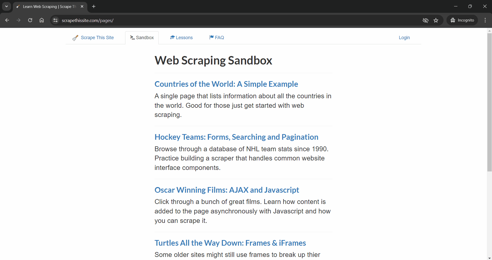
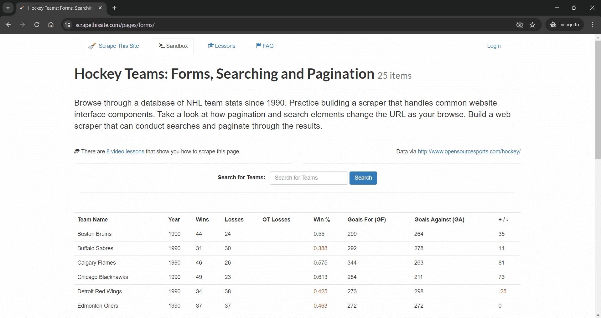
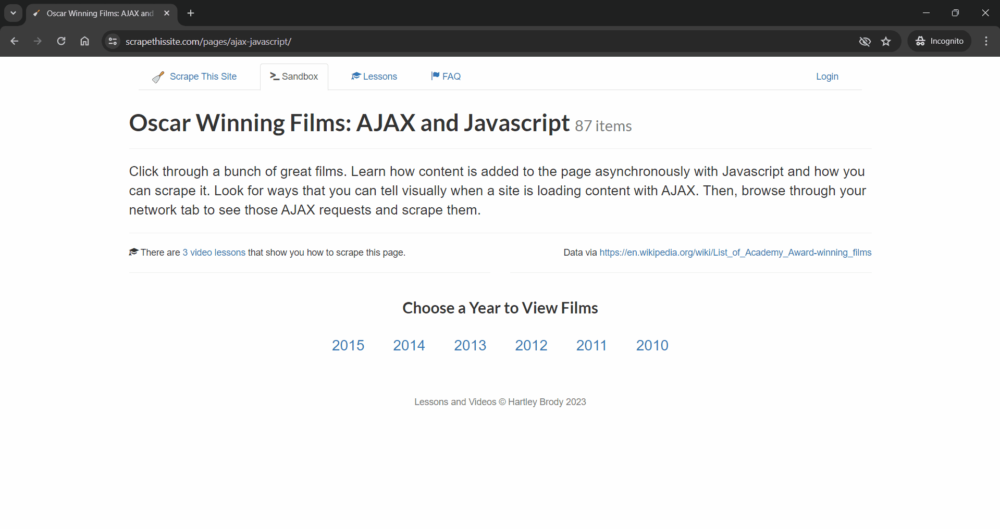

# Web Scraper
Automated web scraping for hockey team data with win percentages below 40% and top 5 Oscar-winning films annually. Extracting and storing this data in JSON format for convenient access and analysis.

## Prerequisites
1. Java 21
2. Gradle 7.5.1
3. VS Code 1.89.1

## Installation Instructions
Clear steps to set up and run the project locally.
1. Make clone of this repo
2. Open in VS code IDE
3. Build using `./gradlew build` command
4. Run test using `./gradlew test` command

## Important Links
1. [Web Scraper](https://www.scrapethissite.com/pages)
2. [Test Cases](https://docs.google.com/spreadsheets/d/1EUVgSbHtBrFIArwm25gRjbfIwNWFH2Jp0JyWlhkZ-Uk/edit?usp=sharing)

## Screenshots

> Web Scraper Web Application

> Hockey Teams: Forms, Searching and Pagination

> Oscar Winning Films: AJAX and Javascript
